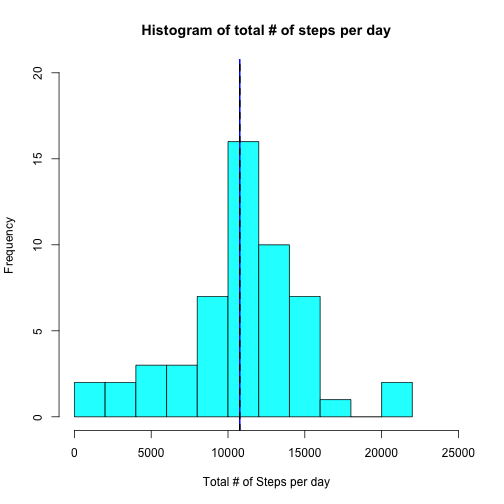
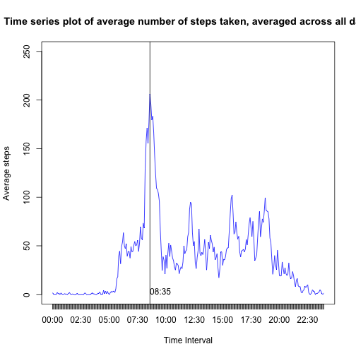
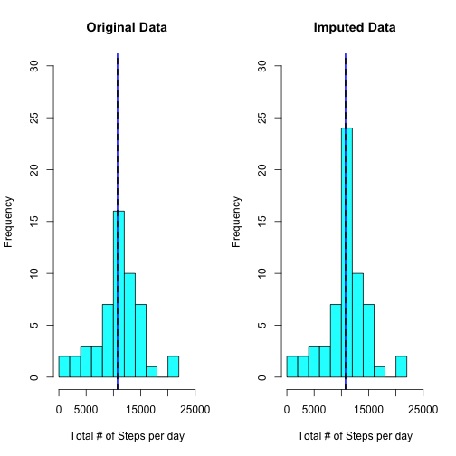
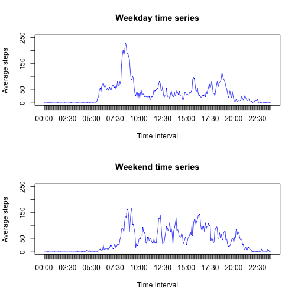

Reproducible Research Assignment #1
=========================================================

We will first read the data into a variable called "activity".
The variables included in this dataset are:

- steps: Number of steps taking in a 5-minute interval (missing values are coded as 𝙽𝙰)
- date: The date on which the measurement was taken in YYYY-MM-DD format
- interval: Identifier for the 5-minute interval in which measurement was taken

The dataset is stored in a comma-separated-value (CSV) file and there are a total of 17,568 observations in this dataset.


```r
activity <- read.csv("activity.csv", stringsAsFactors = F)
activity$date <- as.Date(activity$date, format="%Y-%m-%d")
```

We use the "tapply" function for finding total steps taken per day. The value is stored in a variable called "totalspd", which is short for total steps per day.


```r
totalspd <- with(activity, tapply(steps, date, sum))
```

We now plot a histogram of the total no. of steps taken per day. 
We also plot the mean and the median of the total no. of steps, which appear to coincide.

```r
hist(totalspd, breaks = 10, xlab = "Total # of Steps per day", main = "Histogram of total # of steps per day", ylim = c(0, 20), xlim = c(0, 25000), col = 501)

abline(v = mean(totalspd, na.rm = T), col = 100, lwd = 2)
abline(v = median(totalspd, na.rm = T), col = 1, lty = 2, lwd = 2)
```



So to confirm, we print out the mean and median of the total no. of steps taken per day.


```r
mean(totalspd, na.rm = T)
```

```
## [1] 10766.19
```

```r
median(totalspd, na.rm = T)
```

```
## [1] 10765
```

Making a time series plot of the 5-minute interval (x-axis) and the average number of steps taken, averaged across all days (y-axis):

We first combine the "date" and the "interval" varaibles and make a new column which is in the R date format for easy manipulations.

```r
activity$datetime <- paste0(as.character(activity$date), " ", as.character(activity$interval%/%100), ":", as.character(activity$interval%%100))
activity$datetime <- strptime(activity$datetime, format = "%Y-%m-%d %H:%M")
```

We then use the "strftime" function to isolate the time from the new "datetime" variable and use it to plot a time series plot.


```r
activity$time <- strftime(activity$datetime, format = "%H:%M")
```

We find the average steps per time interval using the new "time" variable. The averages are assigned to a vector named "avgSPI", which is short for average steps per interval.
We observe that the highest average steps per interval occur at 08:35.


```r
avgSPI <- with(activity, tapply(steps, time, mean, na.rm = T))

plot(avgSPI, type = "l", xaxt = "n", col = 300, ylim = c(0, 250), ylab = "Average steps", xlab = "Time Interval", main = "Time series plot of average number of steps taken, averaged across all days")  
axis(1, at = 1:288, labels=names(avgSPI))

abline(v = which.max(avgSPI))
text(which.max(avgSPI), 0, names(which.max(avgSPI)), adj = c(0,0))
```



Finding total no. of missing values:


```r
sum(is.na(activity$steps))
```

```
## [1] 2304
```

In order to impute the missing values we use the means of the 5-minute intervals. So for every NA value we impute the mean steps taken in that time interval across all days.
We finally create a new dataset (activity2) that is equal to the original dataset but with the missing data filled in.


```r
df <- cbind(time = names(avgSPI), avgSPI)
activity2 <- merge(activity, df, by = "time")
activity2 <- activity2[order(activity2$datetime), ]
#imputing missing values in a for loop
for (i in 1:nrow(activity2)){
  if(is.na(activity2[i, 2])) activity2[i, 2] <- as.numeric(as.character(activity2[i, 6]))
}
```

We use the "tapply" function for finding total steps taken per day in the new dataset. The value is stored in a variable called "totalspd2".


```r
totalspd2 <- with(activity2, tapply(steps, date, sum))
```

We then make recreate the initial histogram and contrast it with a new one for the imputed dataset to find what has changed. 


```r
par(mfrow = c(1,2))
hist(totalspd, breaks = 10, xlab = "Total # of Steps per day", main = "Original Data", ylim = c(0, 30), xlim = c(0, 25000), col = 501)
abline(v = mean(totalspd, na.rm = T), col = 100, lwd = 2)
abline(v = median(totalspd, na.rm = T), col = 1, lty = 2, lwd = 2)

hist(totalspd2, breaks = 10, xlab = "Total # of Steps per day", main = "Imputed Data", ylim = c(0, 30), xlim = c(0, 25000), col = 501)
abline(v = mean(totalspd2, na.rm = T), col = 100, lwd = 2)
abline(v = median(totalspd2, na.rm = T), col = 1, lty = 2, lwd = 2)
```



Make a panel plot containing a time series plot of the 5-minute interval (x-axis) and the average number of steps taken, averaged across all weekday days and weekend days (y-axis).


```r
for (i in 1:nrow(activity2))
  {
     if(weekdays(activity2[i, 5]) %in% c("Saturday", "Sunday")) 
          activity2[i, 7] <- "Weekend" 
     else 
          activity2[i, 7] <- "Weekday"
  }

activity3 <- activity2[activity2$V7 == "Weekday", ]
avgSPI3 <- with(activity3, tapply(steps, time, mean, na.rm = T))
activity4 <- activity2[activity2$V7 == "Weekend", ]
avgSPI4 <- with(activity4, tapply(steps, time, mean, na.rm = T))


par(mfrow = c(2,1))

plot(avgSPI3, type = "l", xaxt = "n", col = 300, ylim = c(0, 250), ylab = "Average steps", xlab = "Time Interval", main = "Weekday time series")  
axis(1, at = 1:288, labels=names(avgSPI3))

plot(avgSPI4, type = "l", xaxt = "n", col = 300, ylim = c(0, 250), ylab = "Average steps", xlab = "Time Interval", main = "Weekend time series")  
axis(1, at = 1:288, labels=names(avgSPI4))
```


